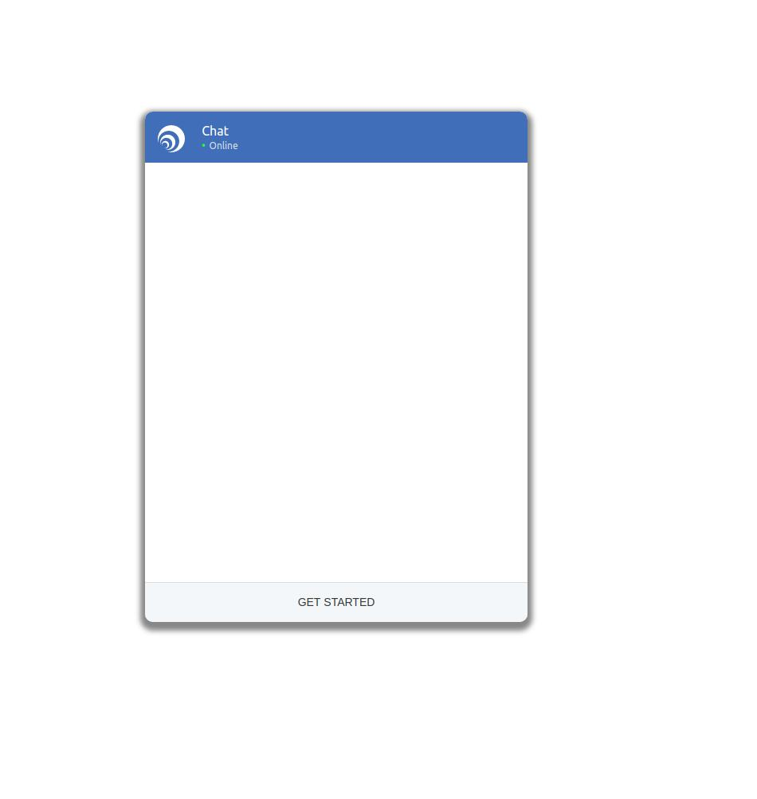

# Cognigy Webchat

This repo contains a webchat that seemlessly integrates with your website and lets your users chat with your conversational assistant built with Cognigy AI.

## Usage
Integrating the Cognigy Webchat is as simple as inserting the following two scripts into the body of your HTML:

```
<script type="text/javascript" src="https://s3.eu-central-1.amazonaws.com/cognigydev/CognigyWebchat/latest/cognigyWebChat.js"></script>
<script>
    const options = {
        "flow": "someFlow",
        "baseUrl": "https://...",
        "apikey": "apikey",
        "designTemplate": 2,
        "colorScheme": "#3D6FBD",
        "persistentMenu": {
            "title": "Menu",
            "menuItems": [
                {
                    "title": "Help",
                    "payload": "Help"
                }
            ]
        },
        "getStartedText": "Hello",
        "getStartedPayload": "Hello"
    };

    Cognigy.init(options);
</script>
```

The first snippet loads a specific [version](#versioning) of the Cognigy Webchat, while the second snippet initializes the Cognigy Webchat based on your [options](#options). Please read about [versioning](#versioning) and the different [options](#options) before integrating this into your website.

## Options
These are the following options you need to initialize the Cognigy Webchat:

| Name              | Type           | Default       | Required | Description
| ------------      | ---------------| --------      | -------- | -----------
| baseUrl           | string         |               | true     | This is the url to environment, e.g. "https://api-yourOrganisation....."
| apikey            | string         |               | true     | This is the apikey to your env. You can find it in admin > settings in the UI console.
| flow              | string         |               | true     | The name of the flow you wish to use in the webchat
| user              | string         | Random user   |          | The username of the user that connects. We initialize the user randomly per default, but you should use a username to have access to the context on multiple visits.
| channel           | string         | "website"     |          | You can access this parameter in the flow via ci.channel, and it is also used in our analytics. The default is "website", but you can change it if you e.g. have multiple websites.
| getStartedText    | string         | "Get Started" |          | The text to display in the chat when clicking the GET_STARTED button on the webchat.
| getStartedPayload | string         | "GET_STARTED" |            | The text to send to your flow when clicking the GET_STARTED button on the webchat.
| messageLogoUrl    | string         |  Cognigy logo |          | The logo to display next to the messages from your bot in the webchat. Defaults to a Cognigy logo.
| headerLogoUrl     | string         | Cognigy Logo  |          | The logo to display in the header of the webchat. Defaults to a Cognigy logo.
| designTemplate    | string         | 1             |          | The webchat design template to use. We default to design template 1. Go [here](#design-templates) for more info.
| colorScheme       | string         | #333333       |          | The background color of the header and bot messages in the webchat
| enableSTT         | boolean        | false         |          | Whether to enable a microphone button that lets the user speak to the webchat instead of only typing.
| enableTTS         | boolean        | false         |          | Whether to enable the browser to read the bot messages aloud.
| resetContext      | boolean        | true          |          | Whether to reset the flow context on each conversation. We highly suggest keeping this value at true.
| resetState        | boolean        | true          |          | Whether to reset the flow state on each converstation. We highly suggest keeping this value at true.
| persistentMenu    | JSON           | None          |          | You can configure a small menu that can help your users navigate through your flow or to switch between mutliple flows. See the example [below](#persistent-menu).

## Persistent Menu
The persistent menu is a great way to show your users all of the capabilites that your bot has. You can use it to switch to different conversation stages, to guide the user and much more. The user can open the menu at any time during the conversation through a small icon in the left corner:


As soon as the user clicks on one of the menu items, a specified payload is sent to your flow.

An example of how to create the persistentMenu is below. The title is the title of the menu ("Menu", "Bots" etc.), and the "menuItems" is a list of all the menuItems you need to help your user. We recommend not putting too much information here as it might confuse more than it helps. Each menuItem has a title, which is what the user sees, and a payload, which is what is sent to your flow.

```
{
  "persistentMenu": {
    "title": "Menu",
    "menuItems": [
        {
          "title": "Help",
          "payload": "Help"
        },
        {
          "title": "Find Restaurants",
          "payload": "Find restaurants near me"
        },
        {
          "title": "Get Recommendations",
          "payload": "Get recommendations for places to eat"
        }
    ]
  }
```

## Versioning
We deploy the webchat into specific version folders on our AWS s3 bucket. The baseUrl will always be: https://s3.eu-central-1.amazonaws.com/cognigydev/CognigyWebchat, followed by a version name, followed by "cognigyWebChat.js". So release v1.0.0 of our webchat is at https://s3.eu-central-1.amazonaws.com/cognigydev/CognigyWebchat/v1.0.0/cognigyWebChat.js. To see all relesases go [here](#releases).

We also keep our very latest webchat deployment as a "latest" release: https://s3.eu-central-1.amazonaws.com/cognigydev/CognigyWebchat/latest/cognigyWebChat.js. You can use this during development to make sure that you have all of the latest features and fixes, however this should not be used in a production website.

## Design Templates
Here at Cognigy, we focus a lot on building conversations, but we are not limited to only building your dialogues - we want to build entire conversational experiences that range from the inner workings of the chatbot to the integration on your website. That is why we have built these design templates that let you experience how you can make conversations a natural and integrated part of your websites. We currently only have two design templates, but there are many more to come.

### Design Template 1
Our first (and default) design template is the standard website chat that you often see in the lower right corner of websites:


This is a standard and safe place to put your webchat, and lets your user's communicate with the bot in a standard way.

### Design Template 2
Our second design template looks like the first, however it is enlarged and centered on the page, enabling you to really put your conversational assistant in focus on your website, or to display the functionality to customers in a nice way.



Note that the color is not unique to the design template, but something that you can freely choose in the colorScheme option in the [options](#options) object.

## Releases
For a detailed list of changes in each release, please go to our [changelog](./changelog.md).

    - Latest: https://s3.eu-central-1.amazonaws.com/cognigydev/CognigyWebchat/latest/cognigyWebChat.js
    - v1.0.3: Added Persistent Menu; Improved carousel on IE and Edge.
    https://s3.eu-central-1.amazonaws.com/cognigydev/CognigyWebchat/v1.0.3/cognigyWebChat.js
    - v1.0.2: Added carousel swiping; Improved view on tablet. https://s3.eu-central-1.amazonaws.com/cognigydev/CognigyWebchat/v1.0.2/cognigyWebChat.js
    - v1.0.1: Added carousel previews. https://s3.eu-central-1.amazonaws.com/cognigydev/CognigyWebchat/v1.0.1/cognigyWebChat.js
    - v1.0.0: https://s3.eu-central-1.amazonaws.com/cognigydev/CognigyWebchat/v1.0.0/cognigyWebChat.js