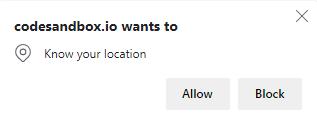
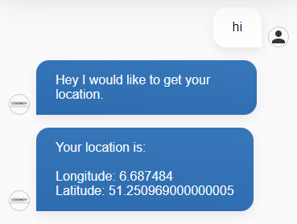

# Get User Geolocation

For some use-cases it could be helpful to have access to the user's geolocation, such as `longitude` and `latitude`. In order to use this information, two steps are required:

1. Ask the user for permission
2. Send the location information to Cognigy.AI

Therefore, the first step is to display the **Location Persmission Pop-Up Window** in the web browser:



This window is displayed by using the [Geolocation API](https://developer.mozilla.org/en-US/docs/Web/API/Geolocation_API) while the following function `geoFindMe()` needs to be added to the website:

```javascript
// Try to get the user's location with the browser geolocation API
 function geoFindMe() {

    // Extract the location (longitude, latitude) on success
    function success(position) {
        const latitude = position.coords.latitude;
        const longitude = position.coords.longitude;

        // Send the location to Cognigy
        // CognigyScript: {{input.data.location.latitude}} and {{input.data.location.longitude}}
        window.webchat.sendMessage("", {
            location: {
              latitude,
              longitude
            }
        });
    }

    // Handle potential errors
    function error() {
        
        // Send the error message to Cognigy
        // CognigyScript: {{input.data.error}}
        window.webchat.sendMessage("", {
            error: "Unable to retrieve your location"
        });
    }

    if (!navigator.geolocation) {
        // Send the error message to Cognigy when the geolocation API is not supported in the used web browser
        // CognigyScript: {{input.data.error}}
        window.webchat.sendMessage("", {
            error: "Geolocation is not supported by your browser"
        });
    } else {
        // Get the current location
        navigator.geolocation.getCurrentPosition(success, error);
    }
}
```

Afterward, the webchat needs to be [initiliazed](./embedding.md) on the website and, futhermore, use the [Analytics API](./analytics-api.md) in order to get notified about Cognigy.AI events:

```javascript
initWebchat("...", {}).then(webchat => {

    // Use the Webchat Analytics API in order to get notified about webchat events 
    webchat.registerAnalyticsService((event) => {
        
        // Listen to incoming messages from the Cognigy.AI virtual agent
        if (event.type === "webchat/incoming-message") {
            const { payload } = event;
            const { text, data } = payload;

            // Example: Check if Cognigy.AI sent a DATA_ONLY message to the webchat with the command to start the location process
            // optional
            if (data?.command === "getLocation") {
                // Execute the geoFindMe() method in order to ask the user for permission in the web browser
                geoFindMe();
            }
        }
    });
});
```

Finally, the successfully extracted location could be sent to the virtual agent:




See it in action:  
[](https://codesandbox.io/s/webchat-get-geolocation-forked-28en9?fontsize=14&hidenavigation=1&theme=dark)